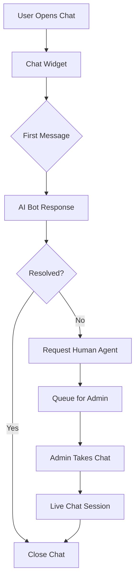

# Customer Support Chat System

Complete chat support with AI bot, live agent handoff, and order context.

## System Architecture



## Conversation Lifecycle

> **Important:** All chat conversations are **persisted until admin marks as closed**. Users can always resume previous conversations.

| Status | Description |
|--------|-------------|
| `bot` | Bot is handling, no human assigned |
| `waiting` | User requested human, in queue |
| `active` | Admin is chatting with user |
| `closed` | Admin closed the conversation |

- Conversations with `closed` status are archived
- User can start **new conversation** after admin closes
- All message history is preserved for reference

## Features Overview

### User Side
| Feature | Description |
|---------|-------------|
| Floating Chat Widget | Bottom-right corner, always visible |
| AI Bot First Response | Quick answers for common questions |
| Order Context | Attach order to conversation |
| File Uploads | Send images of issues |
| Chat History | View past conversations |
| Live Agent Request | Escalate to human support |

### Admin Side
| Feature | Description |
|---------|-------------|
| Support Dashboard | `/admin/support` |
| Active Chats Queue | Pending, Active, Resolved |
| Customer Info Panel | User details, order history |
| Quick Replies | Pre-written responses |
| Chat Assignment | Take chat, transfer to other admin |
| Chat Analytics | Response time, resolution rate |

---

## Bot Capabilities

### Intent Detection
```typescript
type SupportIntent =
    | 'order_status'      // "Where is my order?"
    | 'return_request'    // "I want to return"
    | 'payment_issue'     // "Payment failed"
    | 'product_question'  // "Is this in stock?"
    | 'shipping_query'    // "Do you ship to..."
    | 'refund_status'     // "When will I get refund?"
    | 'cancel_order'      // "Cancel my order"
    | 'human_agent';      // "Talk to human"
```

### Auto-Response Examples
```
User: "Where is my order?"
Bot: "I found your recent order #ORD-XXXX. It's currently **Shipped** 
      and expected to arrive by Dec 18. 
      [Track Order] [Talk to Agent]"

User: "I want to return my order"
Bot: "I can help with that! Your order #ORD-XXXX was delivered 2 days ago.
      You're within the 3-day return window.
      [Start Return Request] [Talk to Agent]"

User: "My payment failed"
Bot: "I'm sorry to hear that. Let me help:
      1. Check if card has sufficient balance
      2. Ensure correct CVV entered
      3. Try a different payment method
      [Retry Payment] [Talk to Agent]"
```

---

## Data Schema

### Firestore Collections

```typescript
// conversations/{conversationId}
interface Conversation {
    id: string;
    userId: string;
    userName: string;
    userEmail: string;
    status: 'bot' | 'waiting' | 'active' | 'resolved';
    assignedTo?: string; // Admin userId
    orderId?: string; // Linked order
    category: 'order' | 'payment' | 'product' | 'general';
    createdAt: Timestamp;
    updatedAt: Timestamp;
    lastMessage: string;
    unreadCount: number;
}

// conversations/{conversationId}/messages/{messageId}
interface Message {
    id: string;
    senderId: string;
    senderType: 'user' | 'bot' | 'admin';
    senderName: string;
    content: string;
    type: 'text' | 'image' | 'quick_reply' | 'order_card';
    metadata?: {
        orderId?: string;
        quickReplies?: string[];
    };
    createdAt: Timestamp;
    read: boolean;
}

// support_queue/{queueId}
interface SupportQueue {
    conversationId: string;
    userId: string;
    priority: 'low' | 'medium' | 'high';
    waitingSince: Timestamp;
    category: string;
}
```

---

## Component Structure

```
src/
├── components/
│   ├── chat/
│   │   ├── ChatWidget.tsx           # Floating button + popup
│   │   ├── ChatWindow.tsx           # Main chat interface
│   │   ├── MessageBubble.tsx        # Single message
│   │   ├── OrderCard.tsx            # Order info in chat
│   │   ├── QuickReplies.tsx         # Bot suggestion buttons
│   │   └── ChatInput.tsx            # Message input + file
│   └── admin/
│       ├── SupportDashboard.tsx     # Admin chat dashboard
│       ├── ChatList.tsx             # List of conversations
│       ├── AdminChatWindow.tsx      # Admin chat view
│       └── CustomerInfoPanel.tsx    # User/order details
├── services/
│   ├── chat.service.ts              # CRUD for conversations
│   └── bot.service.ts               # AI/intent detection
├── hooks/
│   └── useChat.ts                   # Real-time chat hook
└── app/
    └── (admin)/admin/support/
        └── page.tsx                 # Support dashboard
```

---

## Real-Time Implementation

### Using Firestore onSnapshot
```typescript
// Real-time message listener
const useMessages = (conversationId: string) => {
    const [messages, setMessages] = useState<Message[]>([]);
    
    useEffect(() => {
        const unsubscribe = onSnapshot(
            query(
                collection(db, `conversations/${conversationId}/messages`),
                orderBy('createdAt', 'asc')
            ),
            (snapshot) => {
                setMessages(snapshot.docs.map(doc => doc.data() as Message));
            }
        );
        return unsubscribe;
    }, [conversationId]);
    
    return messages;
};
```

---

## Bot Integration Options

### Option 1: Rule-Based (Simple)
- Keyword matching for intents
- Pre-defined responses
- No external API needed

### Option 2: OpenAI/Gemini API (Advanced)
```typescript
async function getBotResponse(message: string, context: ChatContext) {
    const response = await fetch('/api/chat-bot', {
        method: 'POST',
        body: JSON.stringify({
            message,
            orderHistory: context.orders,
            previousMessages: context.messages.slice(-5)
        })
    });
    return response.json();
}
```

### Option 3: Dialogflow (Enterprise)
- Google's conversational AI
- Training with custom intents
- Multi-language support

---

## UI/UX Design

### Chat Widget (User)
```
┌─────────────────────────────────┐
│ 💬 Need Help?                   │
│ ━━━━━━━━━━━━━━━━━━━━━━━━━━━━━━ │
│                                 │
│  [Bot] Hi! How can I help you?  │
│                                 │
│  ┌─────────────────────────┐   │
│  │ Where is my order?      │   │
│  └─────────────────────────┘   │
│  ┌─────────────────────────┐   │
│  │ I want to return        │   │
│  └─────────────────────────┘   │
│  ┌─────────────────────────┐   │
│  │ Payment issue           │   │
│  └─────────────────────────┘   │
│                                 │
│ [Type message...]        [Send] │
└─────────────────────────────────┘
```

### Admin Dashboard
```
┌─────────────────────────────────────────────────────────┐
│ Support Dashboard                     [Online] [Away]   │
├─────────────────┬───────────────────────────────────────┤
│ Chats (12)      │ John Doe                              │
│ ─────────────── │ ──────────────────────────────────── │
│ 🔴 3 Waiting    │ [Order #ORD-XXX] [User Since: 2024]  │
│ 🟢 2 Active     │                                       │
│ ✓ 7 Resolved    │ [User] Where is my order?             │
│                 │ [Bot] Your order is shipped...        │
│ ◉ John - 2m     │ [User] Talk to human                  │
│ ◉ Jane - 5m     │                                       │
│ ○ Mike - 1h     │ [Quick: Checking now | Will update]   │
│                 │                                       │
│                 │ [Type reply...]              [Send]   │
└─────────────────┴───────────────────────────────────────┘
```

---

## Firestore Rules

```javascript
// Conversations
match /conversations/{conversationId} {
    // User can read/write their own conversations
    allow read, write: if request.auth.uid == resource.data.userId;
    // Admin can read/write all
    allow read, write: if isAdmin();
    
    match /messages/{messageId} {
        allow read: if request.auth.uid == get(/databases/$(database)/documents/conversations/$(conversationId)).data.userId || isAdmin();
        allow create: if request.auth != null;
    }
}

// Support queue - admin only
match /support_queue/{queueId} {
    allow read, write: if isAdmin();
}
```

---

## Implementation Phases

### Phase 1: Basic Chat (MVP)
- [ ] Chat widget component
- [ ] Firestore collections setup
- [ ] Send/receive messages
- [ ] Admin chat list

### Phase 2: Bot Integration
- [ ] Intent detection
- [ ] Auto-responses for common queries
- [ ] Order lookup
- [ ] Quick reply buttons

### Phase 3: Live Agent
- [ ] Support queue
- [ ] Admin assignment
- [ ] Real-time typing indicator
- [ ] Chat transfer

### Phase 4: Advanced
- [ ] File/image uploads
- [ ] Chat analytics
- [ ] Satisfaction rating
- [ ] Email transcript
